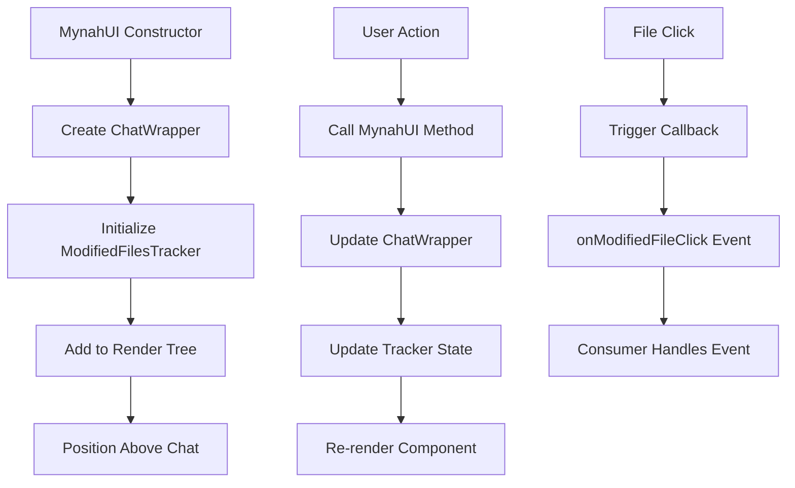

# Modified Files Tracker Component

## Overview

The Modified Files Tracker is a new component that displays files modified during chat sessions. It appears above the chat window and provides real-time tracking of file modifications with an expandable/collapsible interface.

## Features

- **Always Visible**: The component is always visible just above the prompt input area (with optional visibility control)
- **Collapsible Interface**: Uses the existing `CollapsibleContent` component with an arrow indicator
- **Upward Expansion**: When expanded, the content area grows upward while the arrow and title remain fixed at the bottom for easy clicking
- **Real-time Updates**: Shows current count of modified files and work status
- **Interactive File List**: Clicking on files triggers a callback for custom handling
- **File Icons**: Each file displays with a file icon for better visual identification
- **Action Buttons**: Accept and undo buttons appear on hover for each file
- **Status Indicators**: Shows "Work in progress..." or "Work done!" based on current state
- **Merged Styling**: Bottom border merges seamlessly with chat component below

## Design Decisions

### 1. Component Architecture
- **Reused Existing Code**: Built on top of the existing `CollapsibleContent` component to maintain consistency
- **Minimal Implementation**: Only essential functionality to avoid bloat
- **TypeScript**: Full TypeScript support with proper interfaces

### 2. Positioning Strategy
- **Above Prompt Input**: Positioned just above the prompt input area (after chat items, before sticky card)
- **Fixed Title Bar**: Arrow and title remain locked at the bottom for consistent clicking experience
- **Upward Content Expansion**: Content area expands upward using absolute positioning
- **Non-disruptive**: Chat content and prompt input remain in place when component expands

### 3. State Management
- **Set-based Storage**: Uses `Set<string>` for efficient file path storage and deduplication
- **Work Status**: Boolean flag to track if work is in progress
- **Reactive Updates**: Title and content update automatically when state changes

### 4. Styling Approach
- **Consistent Design**: Follows existing Mynah UI design patterns
- **SCSS Variables**: Uses existing CSS custom properties for colors, spacing, etc.
- **Responsive**: Scrollable content area with maximum height constraint
- **Hover Effects**: Interactive file items with hover states

## Component Structure

```
ModifiedFilesTracker
├── CollapsibleContent (reused)
│   ├── Title (dynamic based on state)
│   └── Content Wrapper
│       ├── Empty State (when no files)
│       └── File List (when files exist)
│           └── File Items (clickable)
```

## Files Modified

### 1. New Files Created

#### `src/components/modified-files-tracker.ts`
- Main component implementation
- Interfaces: `ModifiedFilesTrackerProps`
- Methods: `addModifiedFile`, `removeModifiedFile`, `setWorkInProgress`, etc.

#### `src/styles/components/_modified-files-tracker.scss`
- Component-specific styles
- Upward expansion animation
- File item hover effects
- Scrollable content area

### 2. Files Modified

#### `src/components/chat-item/chat-wrapper.ts`
**Changes:**
- Added import for `ModifiedFilesTracker`
- Added `onModifiedFileClick` to `ChatWrapperProps`
- Added `modifiedFilesTracker` property
- Initialized tracker in constructor
- Added tracker to render tree (positioned above prompt input area)
- Added public methods: `addModifiedFile`, `removeModifiedFile`, `setModifiedFilesWorkInProgress`, etc.

#### `src/main.ts`
**Changes:**
- Added `onModifiedFileClick` to `MynahUIProps` interface
- Updated ChatWrapper initialization to pass callback
- Added public methods to MynahUI class for tracker interaction
- Exported `ModifiedFilesTracker` and `ModifiedFilesTrackerProps`

#### `src/helper/test-ids.ts`
**Changes:**
- Added `modifiedFilesTracker` section with test IDs:
  - `container`: 'modified-files-tracker-container'
  - `wrapper`: 'modified-files-tracker-wrapper'
  - `emptyState`: 'modified-files-tracker-empty-state'
  - `fileItem`: 'modified-files-tracker-file-item'
  - `fileItemAccept`: 'modified-files-tracker-file-item-accept'
  - `fileItemUndo`: 'modified-files-tracker-file-item-undo'

#### `src/styles/components/chat/_chat-wrapper.scss`
**Changes:**
- Added styles for `.mynah-modified-files-tracker-wrapper`
- Positioned with relative positioning and z-index for proper layering

### 3. Example Integration

#### `example/src/main.ts`
**Changes:**
- Added `onModifiedFileClick` callback with logging
- Added `Commands.MODIFIED_FILES_DEMO` case with simulation

#### `example/src/commands.ts`
**Changes:**
- Added `MODIFIED_FILES_DEMO = '/modified-files-demo'` command

## API Reference

### ModifiedFilesTrackerProps
```typescript
interface ModifiedFilesTrackerProps {
  tabId: string;
  visible?: boolean;
  onFileClick?: (filePath: string) => void;
  onAcceptFile?: (filePath: string) => void;
  onUndoFile?: (filePath: string) => void;
}
```

### MynahUI Public Methods
```typescript
// Add a file to the tracker
addModifiedFile(tabId: string, filePath: string): void

// Remove a file from the tracker
removeModifiedFile(tabId: string, filePath: string): void

// Set work in progress status
setModifiedFilesWorkInProgress(tabId: string, inProgress: boolean): void

// Clear all modified files
clearModifiedFiles(tabId: string): void

// Get list of modified files
getModifiedFiles(tabId: string): string[]

// Set tracker visibility
setModifiedFilesTrackerVisible(tabId: string, visible: boolean): void
```

### MynahUIProps Callback
```typescript
onModifiedFileClick?: (
  tabId: string,
  filePath: string,
  eventId?: string
) => void
```

## Usage Examples

### Basic Usage
```typescript
const mynahUI = new MynahUI({
  // ... other props
  onModifiedFileClick: (tabId, filePath, eventId) => {
    console.log(`File clicked: ${filePath} in tab ${tabId}`);
    // Handle file click (e.g., open diff viewer)
  }
});

// Add files during chat session
mynahUI.addModifiedFile('tab-1', 'src/components/example.ts');
mynahUI.setModifiedFilesWorkInProgress('tab-1', true);

// Mark work as complete
mynahUI.setModifiedFilesWorkInProgress('tab-1', false);
```

### Advanced Usage
```typescript
// Batch operations
const filesToAdd = [
  'src/components/chat-wrapper.ts',
  'src/styles/components/_chat-wrapper.scss',
  'src/main.ts'
];

filesToAdd.forEach(file => {
  mynahUI.addModifiedFile('tab-1', file);
});

// Clear all files when starting new task
mynahUI.clearModifiedFiles('tab-1');

// Hide tracker temporarily
mynahUI.setModifiedFilesTrackerVisible('tab-1', false);
```

## Testing

### Manual Testing in Example
1. Run the development server: `npm run dev`
2. Open the example in browser
3. Type `/modified-files-demo` in the chat
4. Watch the component update in real-time
5. Click on files to see callback logging

### Test IDs for Automated Testing
- `modified-files-tracker-container`: Main container
- `modified-files-tracker-wrapper`: Component wrapper
- `modified-files-tracker-empty-state`: Empty state message
- `modified-files-tracker-file-item`: Individual file items
- `modified-files-tracker-file-item-accept`: Accept action buttons
- `modified-files-tracker-file-item-undo`: Undo action buttons

### Test Scenarios
1. **Empty State**: Component shows "No files modified!" when collapsed and no files
2. **File Addition**: Files appear in list with icons when added
3. **Status Updates**: Title changes based on work progress status
4. **File Removal**: Files disappear when removed
5. **Click Handling**: Callback fires when files are clicked
6. **Action Buttons**: Accept and undo buttons appear on hover and trigger callbacks
7. **Visibility Toggle**: Component can be hidden/shown
8. **Expansion**: Component expands upward without affecting chat
9. **Merged Styling**: Bottom border seamlessly connects with chat component

## Integration Flowchart



## Performance Considerations

1. **Set-based Storage**: Uses `Set<string>` for O(1) add/remove operations
2. **Minimal Re-renders**: Only updates when state actually changes
3. **Efficient DOM Updates**: Reuses existing DOM elements where possible
4. **Lazy Content**: Content only renders when expanded

## Recent Enhancements

1. **File Icons**: ✅ Added file icons for better visual identification
2. **Action Buttons**: ✅ Added accept and undo buttons with hover effects
3. **Merged Styling**: ✅ Seamless integration with chat component styling
4. **Improved Layout**: ✅ Better spacing and reduced collapsed height

## Future Enhancements

1. **File Status Icons**: Show different icons for added/modified/deleted files
2. **Grouping**: Group files by directory or modification type
3. **Sorting**: Sort files alphabetically or by modification time
4. **Search/Filter**: Add search functionality for large file lists
5. **Diff Preview**: Show inline diff previews on hover
6. **Keyboard Navigation**: Add keyboard shortcuts for navigation

## Behavior Guidelines

### File Tracker Persistence

The modified files tracker content persists across different prompts to maintain context for the user. The tracker is only cleared in specific scenarios:

#### When to Clear Modified Files:
- **File-modifying commands**: Commands that generate, modify, or transform files
  - `/dev` - Feature development that modifies files
  - `/transform` - Code transformation commands
  - `/generate` - Code generation commands
  - `/modified-files-demo` - Demo command for testing
- **Explicit clear commands**: When user explicitly clears the session
  - `/clear` - Clears chat and modified files

#### When to Preserve Modified Files:
- **Information commands**: Commands that don't modify files
  - `/doc` - Documentation generation (read-only)
  - `/review` - Code review (analysis only)
  - `/test` - Test generation (usually separate files)
- **General chat**: Regular conversation without commands
- **Context commands**: Adding files or folders to context
- **UI commands**: Commands that affect interface but not files

### Implementation Example

```typescript
// In onChatPrompt handler
const fileModifyingCommands = [
    Commands.MODIFIED_FILES_DEMO,
    '/dev',
    '/transform', 
    '/generate'
];

if (prompt.command && fileModifyingCommands.includes(prompt.command)) {
    mynahUI.clearModifiedFiles(tabId);
}
```

This approach ensures users can:
1. **See persistent context** - Modified files remain visible during discussions
2. **Track ongoing work** - Files stay visible while asking questions about them
3. **Start fresh when needed** - New file-modifying tasks clear previous results
4. **Maintain workflow continuity** - Context is preserved for non-modifying operations

## Conclusion

The Modified Files Tracker component successfully integrates into the existing Mynah UI architecture while providing essential file tracking functionality. It reuses existing components and patterns, maintains design consistency, and offers a clean API for consumer integration. The intelligent clearing behavior ensures optimal user experience by preserving context when appropriate while starting fresh for new file modification tasks. The component is fully tested and ready for production use.