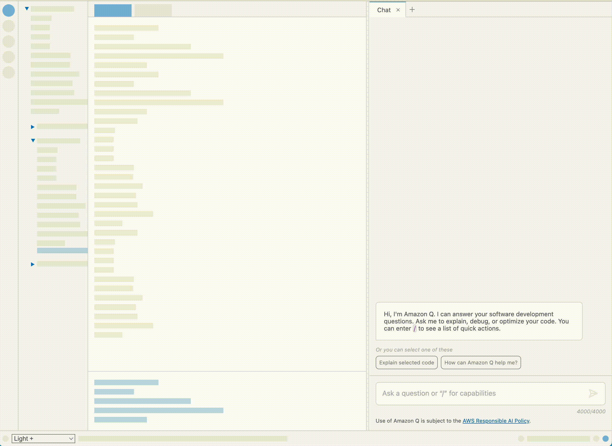

# Mynah UI
> *A Data & Event Driven Chat Interface Library for Browsers and Webviews*

[](https://github.com/aws/mynah-ui/actions/workflows/new_pr.yml)
[](https://github.com/aws/mynah-ui/actions/workflows/beta.yml)
[](https://github.com/aws/mynah-ui/actions/workflows/publish.yml)
[](https://github.com/aws/mynah-ui/actions/workflows/deploy.yml)

**Mynah UI** is a **_data and event_** driven chat interface designed for browsers and webviews on IDEs or any platform supporting the latest web technologies. It is utilized by Amazon Q for [VSCode](https://marketplace.visualstudio.com/items?itemName=AmazonWebServices.aws-toolkit-vscode) and [JetBrains](https://plugins.jetbrains.com/plugin/11349-aws-toolkit--amazon-q-codewhisperer-and-more), and is included with the AWS Toolkit extension.

Mynah UI operates independently of any framework or UI library, enabling seamless integration into any web-based project. This design choice ensures high configurability for theming, supporting various use cases. It functions as a standalone solution, requiring only a designated rendering location within the DOMTree.

## Table of contents
- [Quick links](#quick-links)
- [Setup, configuration and use](#setup-configuration-and-use)
  - [Guides and documentation](#guides-and-documentation)
  - [Preview](#preview)
- [Supported Browsers](#supported-browsers)
- [Security](#security)
- [License](#license)

### Quick links
* [Live Demo](https://aws.github.io/mynah-ui/)
* [API Docs](https://aws.github.io/mynah-ui/api-doc/index.html)

### Setup, configuration and use

>[!TIP]
> Local environment quick start
 ```console
 git clone git@github.com:aws/mynah-ui.git
 cd mynah-ui && npm install
 cd example && npm install
```
Now run `npm watch` in both the `mynah-ui` and the `example` directories, and open `mynah-ui/example/dist/index.html` in a browser of choice.

#### Guides and documentation
Please refer to the following guides:

* [Startup guide](./docs/STARTUP.md)
* [Constructor properties](./docs/PROPERTIES.md)
* [Configuration](./docs/CONFIG.md)
* [Usage](./docs/USAGE.md)
* [Data model](./docs/DATAMODEL.md)
* [Styling](./docs/STYLING.md)
* [Developer guidelines (contribution)](./docs/DEVELOPER.md)

#### Preview


### Supported Browsers

**Mynah UI** <em>- due to its extensive CSS structure -</em> supports only evergreen browsers, including WebKit-based WebUI renderers.

## Security

See [CONTRIBUTING](CONTRIBUTING.md#security-issue-notifications) for more information.

# License
[Apache 2.0 License.](LICENSE)
