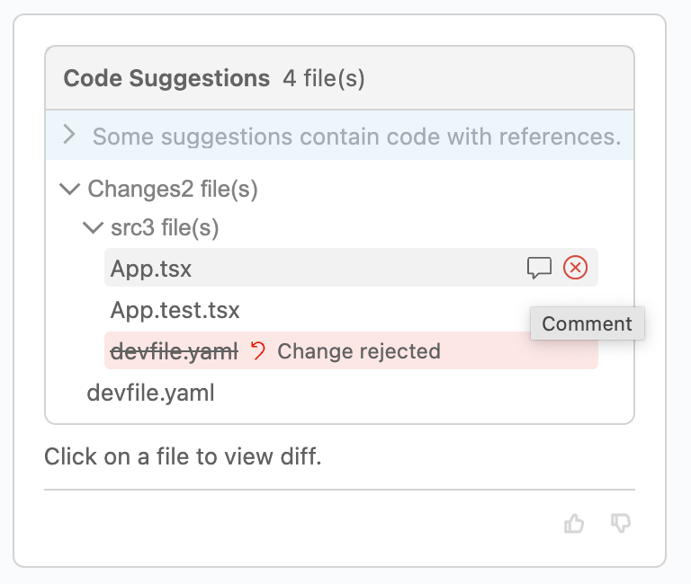
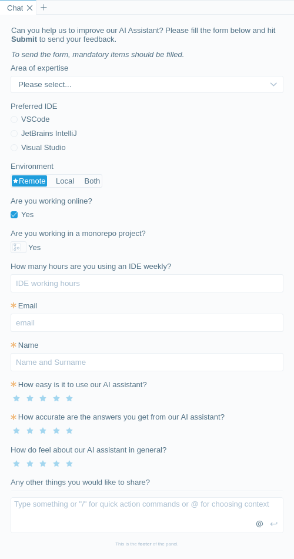
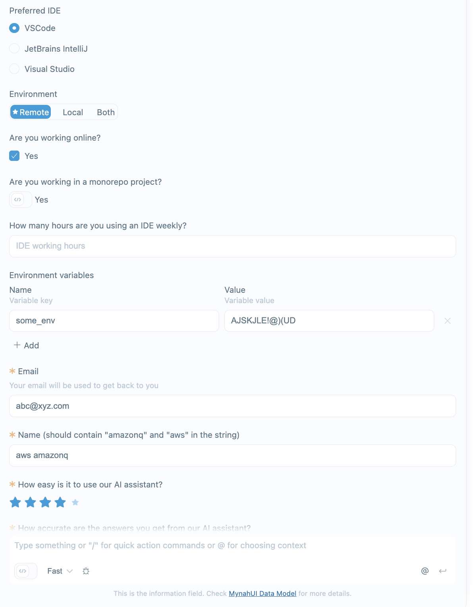
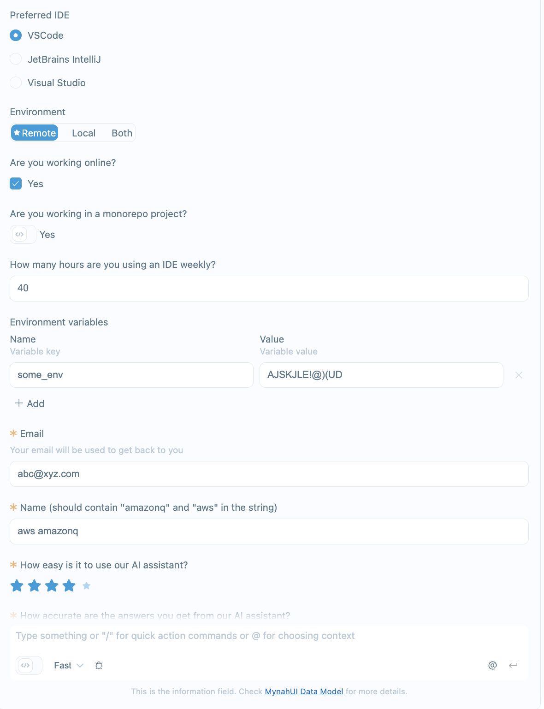
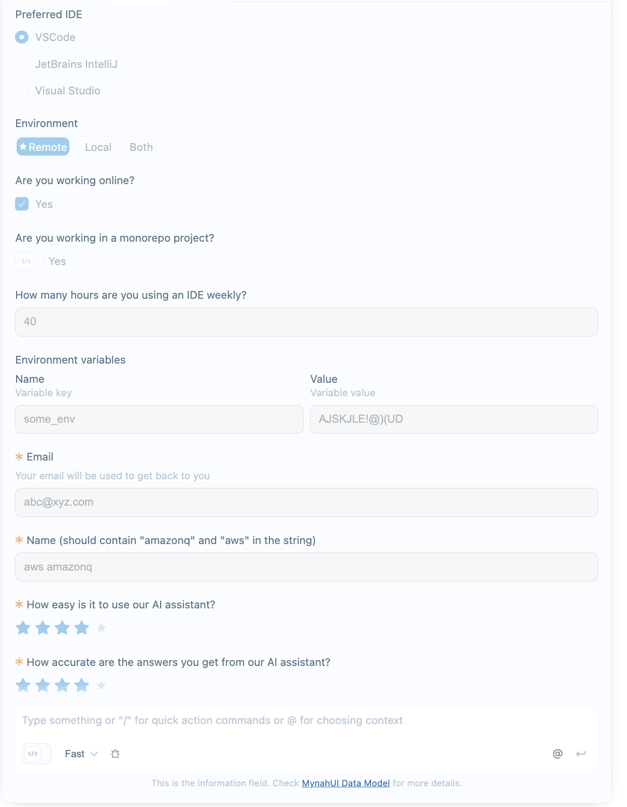

# MynahUI Data Model (with how the things appear on screen)

There are few models for different items on the screen for mynah ui. Let's star from the top and go in detail one by one.

## Tab Data Store

All information you can set related with a tab. 

```typescript
interface MynahUIDataModel {
  /**
   * Tab title
   * */
  tabTitle?: string;
  /**
   * Chat screen loading animation state (mainly use during the stream or getting the initial answer)
   */
  loadingChat?: boolean;
  /**
   * Show cancel button while loading the chat
   * If you want to disable it globally, leave the onStopChatResponse on mynah ui constructor as undefined
   * */
  cancelButtonWhenLoading?: boolean;
  /**
  * Quick Action commands to show when user hits / to the input initially
  */
  quickActionCommands?: QuickActionCommandGroup[];
  /**
  * Placeholder to be shown on prompt input
  */
  promptInputPlaceholder?: string;
  /**
  * Info block to be shown under prompt input
  */
  promptInputInfo?: string; // supports MARKDOWN string
  /**
  * A sticky chat item card on top of the prompt input
  */
  promptInputStickyCard?: Partial<ChatItem> | null;
  /**
  * Prompt input field disabled state, set to true to disable it
  */
  promptInputDisabledState?: boolean;
  /**
  * List of chat item objects to be shown on the web suggestions search screen
  */
  chatItems?: ChatItem[];
}
```

You can set tab data with this model for `defaults`, initial `tabs` which can be set through [Constructor Properties](./PROPERTIES.md) or update a tab on runtime by using `mynahUI.updateStore(...)`.

Let's see which items is what.

### `tabTitle` (default: `"AWS Q"`)
Basically it is the tab title.

```typescript
const mynahUI = new MynahUI({
    tabs: {
        'tab-1': {
            ...
        }
    }
});

mynahUI.updateStore('tab-1', {
    tabTitle: 'Chat'
})
```

<p align="center">
  
</p>

---

### `loadingChat` (default: `false`)
Basically it is the tab title.

```typescript
const mynahUI = new MynahUI({
    tabs: {
        'tab-1': {
            ...
        }
    }
});

mynahUI.updateStore('tab-1', {
    loadingChat: true
})
```
When you set `loadingChat` to true, if there is a streaming card it will start to animate the spinner in two different way. If the card body is empty it will show the `spinnerText` from the texts inside the config right next to a spinning circle. If the card has a body (after it is updated for example) it will show a sliding colored bottom border animation. 

In addition to the spinner, if `onStopChatResponse` is attached globally through MynahUI main class constructor properties _(see [Constructor properties](./PROPERTIES.md) for details)_ and `cancelButtonWhenLoading` is not set to false specifically for that tab it will show the stop generating button too.

<p align="center">
  
</p>
<p align="center">
  
</p>

---


### `cancelButtonWhenLoading` (default: `true`)
If `onStopChatResponse` is attached globally through `MynahUI` main class constructor properties _(see [Constructor properties](./PROPERTIES.md) for details)_ it will show a stop generating button to let the user cancel the ongoing action.

```typescript
const mynahUI = new MynahUI({
    tabs: {
        'tab-1': {
            ...
        }
    }
});

mynahUI.updateStore('tab-1', {
    loadingChat: true,
    cancelButtonWhenLoading: true
})
```

<p align="center">
  
</p>

---


### `quickActionCommands` (default: `[]`)
Quick action commands are the predefined commands which user can pick between. When users hit `/` from their keyboard as the initial char in the input, if there is an available list it will show up as a overlay menu.

If you want a command immediately run after the selection and trigger `onChatPrompt` event (attached to the `MynahUI` main instance through the [Constructor properties](./PROPERTIES.md)) leave the `placeholder` attribute undefined. MynahUI will decide that it doesn't allow additional prompt text for that command and immediately run the trigger. _(See command-2 in the example)_

```typescript
const mynahUI = new MynahUI({
    tabs: {
        'tab-1': {
            ...
        }
    }
});

mynahUI.updateStore('tab-1', {
    quickActionCommands: [
        {
            groupName: 'Command Group 1',
            commands: [
            {
                command: '/command-1',
                placeholder: 'Command which accepts a prompt after the command selection',
                description: 'Command 1 description',
            },
            {
                command: '/command-2',
                description: 'Command 2 description',
            },
            ],
        },
        {
            groupName: 'Command Group 2',
            commands: [
            {
                command: '/command-3',
                placeholder: 'Command which accepts a prompt after the command selection',
                description: 'Command 3 description',
            },
            ],
        },
        {
            // Command Group without title
            commands: [
            {
                command: '/command-4',
                placeholder: 'Command which accepts a prompt after the command selection',
                description: 'Command 4 description',
            },
            ],
        },
    ]
})
```

<p align="center">
  
</p>

To handle the incoming command (if there is) check it with the prompt object in the `onChatPrompt` event.

```typescript
const mynahUI = new MynahUI({
    ...
    onChatPrompt: (prompt)=>{
        if(prompt.command !== undefined){
            switch (prompt.command) {
                case '/command-1':
                    console.log(`Command 1 selected with prompt: ${prompt.prompt}`);
                    break;
                case '/command-2':
                    console.log('Command 2 selected');
                    break;
                default:
                    ...
                    break;
                }
        }
    }
});
```

---

### `promptInputPlaceholder` (default: `''`)

This is the placeholder text for the prompt input

```typescript
const mynahUI = new MynahUI({
    tabs: {
        'tab-1': {
            ...
        }
    }
});

mynahUI.updateStore('tab-1', {
    promptInputPlaceholder: 'Ask a question or “/” for capabilities'
})
```

<p align="center">
  
</p>

---

### `promptInputInfo` (default: `''`)

This is a info field under the bottom of the prompt input field, like a footer text

```typescript
const mynahUI = new MynahUI({
    tabs: {
        'tab-1': {
            ...
        }
    }
});

mynahUI.updateStore('tab-1', {
    promptInputInfo: 'Use of Amazon Q is subject to the [AWS Responsible AI Policy](https://aws.com).',
})
```

<p align="center">
  
</p>

---

### `promptInputStickyCard` (default: `null`)

This is a chat item card which will be shown on top of the prompt input field. Main usage scneario for this is to inform the user with a card view, which means that it can also have some actions etc.

```typescript
const mynahUI = new MynahUI({
    tabs: {
        'tab-1': {
            ...
        }
    },
    ...
    onInBodyButtonClicked: (tabId: string, messageId: string, action) => {
      if(messageId === 'sticky-card'){
        // clear the card
        mynahUI.updateStore(tabId, {promptInputStickyCard: null});
      }
      ...
    },
    ...
});

mynahUI.updateStore(tabId, {
    promptInputStickyCard: {
        messageId: 'sticky-card',
        body: `Please read the [terms and conditions change](#) and after that click the **Acknowledge** button below!`,
        status: 'info',
        icon: MynahIcons.INFO,
        buttons: [
            {
                // you can also simply set this to false to remove the card automatically
                keepCardAfterClick: true,
                text: 'Acknowledge',
                id: 'acknowledge',
                status: 'info',
                icon: MynahIcons.OK
            },
        ],
    }
});

```

<p align="center">
  
</p>

---

### `promptInputDisabledState` (default: `false`)

This is the disabled state if the prompt input field. When set to true, user cannot focus to the input and cannot click to the send button.

```typescript
const mynahUI = new MynahUI({
    tabs: {
        'tab-1': {
            ...
        }
    }
});

mynahUI.updateStore('tab-1', {
    promptInputDisabledState: true,
})
```

<p align="center">
  
</p>

---

### `chatItems` (default: `[]`)

This is holding the chat items. If you provide it through the `defaults` or inside a tab item in the initial `tabs` property in the [Constructor properties](./PROPERTIES.md) you can give the whole set.

**BUT** if you will set it through `updateStore` it will append the items in the list to the current chatItems list. In case if you need to update the list with a new one manually on runtime, you need to send an empty list first and than send the desired new list.

```typescript
const mynahUI = new MynahUI({
    tabs: {
        'tab-1': {
            ...
        }
    }
});

mynahUI.updateStore('tab-1', {
    chatItems: [],
})
```

<p><br/></p>

---

<p><br/></p>

# `ChatItem` (and how they appear on screen)

There are basically 2 main types of chat items. One is to show a file list and the other one is for all other items with a body of markdown string content.

Let's start with the model definition:

```typescript
// There can be more types on the ChatItemType enum list
// However those are the only ones getting used by MynahUI
enum ChatItemType {
  CODE_RESULT = 'code-result',
  ANSWER_STREAM = 'answer-stream',
  ANSWER = 'answer',
  PROMPT = 'prompt',
  SYSTEM_PROMPT = 'system-prompt'
}

interface ChatItem {
  type: ChatItemType;
  fileList?: {
    filePaths?: string[];
    deletedFiles?: string[];
  };
  body?: string; // supports MARKDOWN string
  messageId?: string;
  canBeVoted?: boolean; // requires messageId to be filled to show vote thumbs
  relatedContent?: {
    title?: string;
    content: SourceLink[];
  };
  followUp?: {
    text?: string;
    options?: ChatItemAction[];
  };
  buttons?: ChatItemButton[];
  formItems?: ChatItemFormItem[];
  status?: 'error' | 'success' | 'warning' | 'info';
  icon?: MynahIcons;
  codeReference?: ReferenceTrackerInformation[];
}
```

Let's see all kind of examples and what parameter reflects to what.

## `type`

### ChatItemType.`CODE_RESULT` and `fileList` _(position: left)_

Use for showing a file list. You have to provide the `fileList` if your chat item type is `CODE_RESULT`. See the example below.

```typescript
const mynahUI = new MynahUI({
    tabs: {
        'tab-1': {
            ...
        }
    }
});

mynahUI.addChatItem(tabId, {
    type: ChatItemType.CODE_RESULT,
    fileList: {
        filePaths: [ 'src/App.tsx', 'devfile.yaml', 'src/App.test.tsx' ],
    },
    codeReference: [
        {
            information: 'Reference code *under the MIT license* from repository `amazon`.'
        },
        {
            information: 'Reference code *under the MIT license* from repository `aws`.'
        },
    ],
    canBeVoted: true,
    messageId: new Date().getTime().toString()
});
```

<p align="center">
  
</p>

---

### ChatItemType.`ANSWER_STREAM` _(position: left)_
Use for streaming cards. It is better to start with an empty string to let the initial spinner rotate. As far as the `loadingState` is true for the tab which holds this chat item, it will show the spinner (rotating circle for empty state and bottom border for with a body). 

When you add a new chat item with type `ANSWER_STREAM` MynahUI will set it as the streaming card and when you call `updateLastChatAnswer` it will update this.

```typescript
const mynahUI = new MynahUI({
    tabs: {
        'tab-1': {
            ...
        }
    }
});

mynahUI.addChatItem('tab-1', {
    type: ChatItemType.ANSWER_STREAM,
    body: ''
});

// After a moment
mynahUI.updateLastChatAnswer('tab-1', {
    body: `### How to create a React stateless function component

*React .14* introduced a simpler way to define components called stateless functional components.
    `
});
```

<p align="center">
  
</p>

---

### ChatItemType.`ANSWER` _(position: left)_
Use for all kind of answers. Including the followups etc.

And yes, except the `fileList` you can combine followups and markdown string content chat items at once. Which means that a single chat item can also contain the `followUp` at the same time with `body`.

```typescript
const mynahUI = new MynahUI({
    tabs: {
        'tab-1': {
            ...
        }
    }
});

mynahUI.addChatItem('tab-1', {
    type: ChatItemType.ANSWER,
    body: 'Hi, I\'m Amazon Q. I can answer your software development questions. Ask me to explain, debug, or optimize your code. You can enter `/` to see a list of quick actions.'
    followUp:{
        text: 'Or you can select one of these',
        options: [
            {
                pillText: 'Explain selected code',
            },
            {
                pillText: 'How can Amazon Q help me?',
                prompt: 'How can Amazon Q help me?',
            }
        ],
    }
});
```

<p align="center">
  
</p>

---

### ChatItemType.`PROMPT` _(position: right)_
Use for user prompts. You can also send followups to let them appear on right. 

```typescript
const mynahUI = new MynahUI({
    tabs: {
        'tab-1': {
            ...
        }
    }
});

mynahUI.addChatItem('tab-1', {
    type: ChatItemType.PROMPT,
    body: 'Who are you?'
});

mynahUI.addChatItem('tab-1', {
    type: ChatItemType.PROMPT,
    followUp:{
        text: 'Or you can select one of these',
        options: [
            {
                pillText: 'Explain selected code',
            },
            {
                pillText: 'How can Amazon Q help me?',
                prompt: 'How can Amazon Q help me?',
            }
        ],
    }
});
```

<p align="center">
  
</p>

---

### ChatItemType.`SYSTEM_PROMPT` _(position: right)_
Use for sysyem prompts. Only difference with `PROMPT` is the color of the chat card. (Depends on your **[Styling Configuration](STYLING.md)**) You can also send followups to let them appear on right. 

```typescript
const mynahUI = new MynahUI({
    tabs: {
        'tab-1': {
            ...
        }
    }
});

mynahUI.addChatItem('tab-1', {
    type: ChatItemType.SYSTEM_PROMPT,
    body: 'This is a system prompt'
});

mynahUI.addChatItem('tab-1', {
    type: ChatItemType.SYSTEM_PROMPT,
    followUp: {
    text: 'Or you can select one of these',
    options: [
        {
            pillText: 'Explain selected code',
        },
        {
            pillText: 'How can Amazon Q help me?',
            prompt: 'How can Amazon Q help me?',
        }
    ],
    }
});
```

<p align="center">
  
</p>

---

## `body`
Basically the body of the card. Which you can send a full markdown string. Allows code blocks, links etc. 

```typescript
const mynahUI = new MynahUI({
    tabs: {
        'tab-1': {
            ...
        }
    }
});

mynahUI.addChatItem('tab-1', {
    type: ChatItemType.ANSWER,
    body: "## Here'a heading 2\nAnd also here are some code blocks which supports most common languages.\n```typescript\nconst a = 5;\n```\n You can also use some `inline code` items too.\n And also for example [a link](https://aws.com)"
});
```

<p align="center">
  
</p>

---

## `canBeVoted`
It enables the up and down vote buttons for that particular chat item. Important thing to remember here is that you have provide a `messageId` together with the `canBeVoted` to let the buttons appear and trigger the `onVote` event which can be binded through [Constructor properties](./PROPERTIES.md).

```typescript
const mynahUI = new MynahUI({
    tabs: {
        'tab-1': {
            ...
        }
    }
});

mynahUI.addChatItem('tab-1', {
    type: ChatItemType.ANSWER,
    messageId: '1', // Should be a unique one,
    canBeVoted: true,
    body: "Here's a message which **can** be voted."
});

mynahUI.addChatItem('tab-1', {
    type: ChatItemType.ANSWER,
    messageId: '2', // Should be a unique one,
    canBeVoted: false,
    body: "Here's another message which **cannot** be voted."
});
```

<p align="center">
  
</p>

---

## `relatedContent`
It allows you to show some related links under the body of the chat item. It shows one item and if you provided more user can expand the list with the show more button. 

If you also provide a markdown body for the source link, it will generate a tooltip to show more details for it.

See the example below.

```typescript
const mynahUI = new MynahUI({
    tabs: {
        'tab-1': {
            ...
        }
    }
});

mynahUI.addChatItem('tab-1', {
    type: ChatItemType.ANSWER,
    messageId: '1', // Should be a unique one,
    body: "Here's a message with source links.",
    relatedContent: {
        title: 'Related Link',
        content: [
            {
                url: 'https://aws.com/deep/url/1',
                title: 'Related content 1',
                body: '## This is the body of the related\nAnd yes it also supports markdown!\n```typescript\nconst a = 5;\n```\n',
            },
            {
                url: 'https://aws.com/more/deeper/url/2',
                title: 'Related content 2',
            },
            {
                url: 'https://aws.com/deep/url/3',
                title: 'Related content 3',
            }
        ]
    }
});
```

<p align="center">
  
</p>
<p align="center">
  
</p>
<p align="center">
  
</p>

---

## `buttons`
It allows you to add actions inside a chat item card. **BUT, beware that when those actions are clicked if you set the `keepCardAfterClick` to false, they will remove the card they are in.**. 

**Another important point** for the buttons are related with the [`formItems`](#formItems), when a button is clicked and it keeps the card instead of removing it, **it will disable** all the form items and also the buttons inside that card.

Let's see the data type for buttons:
```typescript
interface ChatItemButton {
  keepCardAfterClick?: boolean; // default true, if you want the button to remove the card, set it to false
  waitMandatoryFormItems?: boolean; // Wait till the mandatory form items inside the same card to be filled to enable the button if there is any
  // Please see formItems section for a detailed usage
  text: string; // Text inside the button
  id: string; // id of the button, since when they are clicked they all call the same property onInBodyButtonClicked
  disabled?: boolean; // in any case if you want to make the button disabled (mandatory check will discard this)
  description?: string; // A text to be shown inside a tooltip and it can be markdown
  status?: 'info' | 'success' | 'warning' | 'error'; // 4 color status for the buttons
  icon?: MynahIcons; // in case if you want to put an icon to the button.
}
```

See the example below.

```typescript
const mynahUI = new MynahUI({
    tabs: {
        'tab-1': {
            ...
        }
    }
});

mynahUI.addChatItem(tabId, {
    type: ChatItemType.ANSWER,
    messageId: new Date().getTime().toString(),
    body: `This is a card with actions inside!`,
    buttons: [
    {
        text: 'Action 1',
        id: 'action-1',
        status: 'info',
        icon: MynahIcons.CHAT
    },
    {
        text: 'Action 2',
        description: 'This action will not remove the card!',
        id: 'action-2',
        keepCardAfterClick: false, // So when this button is clicked, it will remove the whole card.
    },
    {
        text: 'Action 3',
        description: 'This is disabled for some reason!',
        id: 'action-3',
        disabled: true,
    },
    ],
});
```

<p align="center">
  
</p>

---

## `formItems`
It allows you to add some form elements inside a chat item card. Currently it supports `textarea`, `textinput`, `numericinput`, `stars`, `radiogroup` and `select` components. 

**Important notice:** You need to use [`buttons`](#buttons) to get the values set by the user for those options.

Let's take a look to the data type of a form item:
```typescript
interface ChatItemFormItem {
  id: string; // id is mandatory to understand to get the specific values for each form item when a button is clicked
  type: 'select' | 'textarea' | 'textinput' | 'numericinput' | 'stars' | 'radiogroup'; // type (see below for each of them)
  mandatory?: boolean; // If it is set to true, buttons in the same card with waitMandatoryFormItems set to true will wait them to be filled
  title?: string; // Label of the input
  placeholder?: string; // Placeholder for input, but only applicable to textarea, textinput and numericinput
  value?: string; // Initial value of the item. All types of form items will get and return string values, conversion of the value type is up to you
  options?: Array<{ // Only applicable to select and radiogroup types
    value: string;
    label: string;
  }>;
}
```

Since you can give unlimited form items with several different types, it might be good to know that some attributes are only applicable to some types. Like `options` attribute is only getting used by `select` and `radiogroup` items. Or `placeholder` is only getting used by `textarea`, `textinput` and `numericinput`.

**Another thing which might be interesting** is to know that if you set the `select` or the `radiogroup` mandatory, they'll be rendered as the first item's of them selected if you don't provide an initial value. And you cannot deselet a radio item in any case. For select, if it is mandatory there won't be the option `Please select...`


_**NOTE**: If you set `options` for `textinput` for example, it won't affect the textinput to be rendered and work properly._

##### Let's see a very detailed example below.

```typescript
const mynahUI = new MynahUI({
    tabs: {
        'tab-1': {
            ...
        }
    }
});

mynahUI.addChatItem(tabId, {
    type: ChatItemType.ANSWER,
    messageId: new Date().getTime().toString(),
    body: 
    `Can you help us to improve our AI Assistant? Please fill the form below and hit **Submit** to send your feedback.
    _To send the form, mandatory items should be filled._`,
    formItems: [
        {
            id: 'expertise-area',
            type: 'select',
            title: `Area of expertise`,
            options: [
                {
                    label: 'Frontend',
                    value: 'frontend'
                },
                {
                    label: 'Backend',
                    value: 'backend'
                },
                {
                    label: 'Data Science',
                    value: 'datascience'
                },
                {
                    label: 'Other',
                    value: 'other'
                }
            ]
        },
        {
            id: 'preferred-ide',
            type: 'radiogroup',
            title: `Preferred IDE`,
            options: [
                {
                    label: 'VSCode',
                    value: 'vscode'
                },
                {
                    label: 'JetBrains IntelliJ',
                    value: 'intellij'
                },
                {
                    label: 'Visual Studio',
                    value: 'intellij'
                }
            ]
        },
        {
            id: 'working-hours',
            type: 'numericinput',
            title: `How many hours are you using an IDE weekly?`,
            placeholder: 'IDE working hours',
        },
        {
            id: 'email',
            type: 'textinput',
            mandatory: true,
            title: `Email`,
            placeholder: 'email',
        },
        {
            id: 'name',
            type: 'textinput',
            mandatory: true,
            title: `Name`,
            placeholder: 'Name and Surname',
        },
        {
            id: 'ease-of-usage-rating',
            type: 'stars',
            mandatory: true,
            title: `How easy is it to use our AI assistant?`,
        },
        {
            id: 'accuracy-rating',
            type: 'stars',
            mandatory: true,
            title: `How accurate are the answers you get from our AI assistant?`,
        },
        {
            id: 'general-rating',
            type: 'stars',
            title: `How do feel about our AI assistant in general?`,
        },
        {
            id: 'description',
            type: 'textarea',
            title: `Any other things you would like to share?`,
            placeholder: 'Write your feelings about our tool',
        }
    ],
    buttons: [
        {
            id: 'submit',
            text: 'Submit',
            status: 'info',
        },
        {
            id: 'cancel-feedback',
            text: 'Cancel',
            keepCardAfterClick: false,
            waitMandatoryFormItems: false,
        }
    ],
});
```

<p align="center">
  
</p>

In it's current state, you'll see some asterisk icons on the left of the label fields if the items are mandatory. And as you can see according to the configuration we've prepared above, `Submit` button is currently disabled. Because it waits the `email`, `name`, `ease of use stars` and `accuracy stars` to be filled/selected.

Let's see what happens when we fill them:

<p align="center">
  
</p>

**Now our `Submit` button is activated**. But before submitting it, let's fill all the fields.

<p align="center">
  
</p>


Ok, finally, when we click the `Submit` button, as it is configured that way, it will keep the card, but all the form fields and the buttons will be disabled. 

<p align="center">
  
</p>


**Note:** As you can see. `Cancel` button has the value for `keepCardAfterClick` and `waitMandatoryItems` as `false` which means that `Cancel` button won't be disabled even if the form is not valid _(mandatory fields not filled)_ and when clicked it will remove the whole card.

A sample return to the [onInBodyButtonClicked](./PROPERTIES.md#oninbodybuttonclicked) function
```console
Body action clicked in message 1707218619540:
Action Id: submit
Action Text: Submit

Options:
expertise-area: frontend
preferred-ide: vscode
working-hours: 30
email: dogusata@amazon.com
name: Dogus Atasoy
ease-of-usage-rating: 5
accuracy-rating: 4
general-rating: 5
description: It is lovely!
```

---


## `status`
It allows you to set the border color of the card. Currently you can select one of the below status types: 

`success`, `info`, `error`, `warning`

See the example below.

```typescript
const mynahUI = new MynahUI({
    tabs: {
        'tab-1': {
            ...
        }
    }
});

mynahUI.addChatItem(tabId, {
    type: ChatItemType.ANSWER,
    messageId: new Date().getTime().toString(),
    body: `This is a card with status indication border!`,
    status: 'success',
});
```

<p align="center">
  
</p>

---

## `icon`
It allows you to set an icon on the left top corner of the card. You should use one from `MynahIcons`. 

See the example below.

```typescript
const mynahUI = new MynahUI({
    tabs: {
        'tab-1': {
            ...
        }
    }
});

// Just the icon
mynahUI.addChatItem(tabId, {
    type: ChatItemType.ANSWER,
    messageId: new Date().getTime().toString(),
    body: `This is a card with an icon!`,
    icon: MynahIcons.CHAT,
});

// Icon with status
mynahUI.addChatItem(tabId, {
    type: ChatItemType.ANSWER,
    messageId: new Date().getTime().toString(),
    body: `This is a card with an icon and a status!`,
    status: 'info',
    icon: MynahIcons.CHAT,
});
```

<p align="center">
  
</p>

---

## `followUp`
Followups allows you to add predefined direct triggers for the user for ease of use. Instead of typing a followup question, they can select from the provided ones. But you can also use them to get user input some from multiple choice options before going further for example. 

Here's the model for the `options` attribute for the `followUp`.

```typescript
interface ChatItemAction {
  type?: string;
  pillText: string;
  prompt?: string;
  disabled?: boolean;
  description?: string;
  status?: 'info' | 'success' | 'warning' | 'error';
  icon?: MynahIcons;
}
```

Let's see all the possible options you can do with the followups.

```typescript
const mynahUI = new MynahUI({
    tabs: {
        'tab-1': {
            ...
        }
    }
});

mynahUI.addChatItem('tab-1', {
    type: ChatItemType.ANSWER,
    followUp: {
        text: 'Followup All option types',
        options: [
            {
                pillText: 'Trigger automatically',
                prompt: 'This prompt will be triggered automatically',
            },
            {
                pillText: 'Followup with tooltip',
                description: 'This markdown will be shown **when you hover only**.'
            },
            {
                pillText: 'Status Danger',
                status: 'error',
                icon: MynahIcons.BLOCK,
            },
            {
                pillText: 'Status Warning',
                status: 'warning',
                icon: MynahIcons.WARNING,
            },
            {
                pillText: 'Status Ok',
                status: 'success',
                icon: MynahIcons.OK,
            },
            {
                pillText: 'Status Info',
                status: 'info',
            },
            {
                pillText: 'This is disabled',
                disabled: true,
            }
        ]
    }
});
```

<p align="center">
  
</p>


You can also make them appear on the right by just changing the type of the chat item.

```typescript
mynahUI.addChatItem('tab-1', {
    type: ChatItemType.SYSTEM_PROMPT,
    followUp: {
        ... // Same with above
    }
});
```

<p align="center">
  
</p>

---

## `codeReference`
This is one of the most complex and hard to tell features you can use on `MynahUI`. But it basically allows you to add some highlights and let them show some tooltips when user hovers to them. 

They reflect their position according to the whole body

**BUT;** if they appear inside a code block, when user clicks one of the copy or the insert to cursor position buttons in the footer of the code block, that `codeReference` content span position will be recalculated according to the position inside the code block while sending it to the events `onCopyCodeToClipboard` or `onCodeInsertToCursorPosition` which can be binded through [Constructor properties](./PROPERTIES.md).

#### Note:
The position for the recommandation span has to be calculated considering all chars in the string. Even the back ticks etc.

```typescript
interface ReferenceTrackerInformation {
  licenseName?: string; // optional, not used on UI
  repository?: string; // optional, not used on UI
  url?: string; // optional, not used on UI
  recommendationContentSpan: {
    start: number;
    end: number;
  };
  information: string; // supports MARKDOWN, will be shown on tooltip
}
```

Let's see how it works and looks like.

To make it easy to read, let's assume that the below block is the body content for us and we've assigned it to a constant called **`bodyContent`**.

>\#\#\# How to create a React stateless function component\
\
*React .14* introduced a simpler way to define components called stateless functional components.\
\
First let's start generating a react \`functional\` component.
\
\
Functional components are just JavaScript functions. They take in an optional input which we call as \`props\`.
\
\
\`\`\`tsx\
import React from 'react';\
\
interface MyStatelessFunctionalComponentProps {\
    value: string;\
    onChange: (value: string) => void;\
}\
\
export const MyStatelessFunctionalComponent = (props: MyStatelessFunctionalComponentProps) => {\
    return <>\
        \<input\
            type="text"\
            placeholder="placeholder"\
            value={props.value}\
            onChange={props.onChange}/>\
    </>\
}\
\`\`\`\
\[Link inside body!\]\(https://google.com\).\
\
In this case, our input component will only use the given value through props which will come from the parent and it will not have any state. When you type into the input element, even it will change the value visually, it will not change the actual holded value. We should inform parent when the value is changed. We will use \`onChange\` prop here.\
&nbsp;

**And let's use that `bodyContent` now.**
```typescript
const mynahUI = new MynahUI({
    tabs: {
        'tab-1': {
            ...
        }
    }
});
const bodyContent = MARKDOWN; // above markdown text

mynahUI.addChatItem('tab-1', {
    type: ChatItemType.ANSWER,
    body: bodyContent,
    codeReference: [
        {
            recommendationContentSpan: {
                start: 362,
                end: 470
            },
            information: 'Reference code *under the MIT license* from repository `amazon`.'
        },
        {
            recommendationContentSpan: {
                start: 484,
                end: 514
            },
            information: '**Reference tracker information:**\n\rReference code *under the MIT license* from repository `aws`.'
        }
    ]
});
```

<p align="center">
  
</p>

Here's what you'll see when you hover to them.

<p align="center">
  
</p>

<p>
  <br />
</p>

---

<p>
  <br />
</p>

## `NotificationProps`

To show a notification inside the `MynahUI` block, you can use the notify function, and here's how they look like.

```typescript
enum NotificationType {
  INFO = ...,
  SUCCESS = ...,
  WARNING = ...,
  ERROR = ...,
}

interface NotificationProps {
  duration?: number;
  type?: NotificationType;
  title?: string;
  content: NotificationContentType | NotificationContentType[]; // Can be a string or HTMLElement
  onNotificationClick?: () => void;
  onNotificationHide?: () => void;
}
```

Here are some examples:

```typescript
const mynahUI = new MynahUI(...);
mynahUI.notify({
    content: 'Content block', // not optional
    duration: -1, // will stay forever until user cliks,
    type: NotificationType.INFO, // This is the default
    title: 'Notification',
});
```
<p align="center">
  
</p>

```typescript
const mynahUI = new MynahUI(...);
mynahUI.notify({
    content: 'An error occured.',
    duration: 5000, // will stay 5 seconds on the screen
    type: NotificationType.ERROR,
    title: 'Error',
});
```

<p align="center">
  
</p>

```typescript
const mynahUI = new MynahUI(...);
mynahUI.notify({
    content: 'This is the last warning!',
    duration: 5000,
    type: NotificationType.WARNING,
    title: 'Warning!',
});
```

<p align="center">
  
</p>

```typescript
const mynahUI = new MynahUI(...);
mynahUI.notify({
    content: 'You\'ve succeeded!',
    duration: 5000,
    type: NotificationType.SUCCESS,
    title: 'Congrats!',
});
```

<p align="center">
  
</p>
