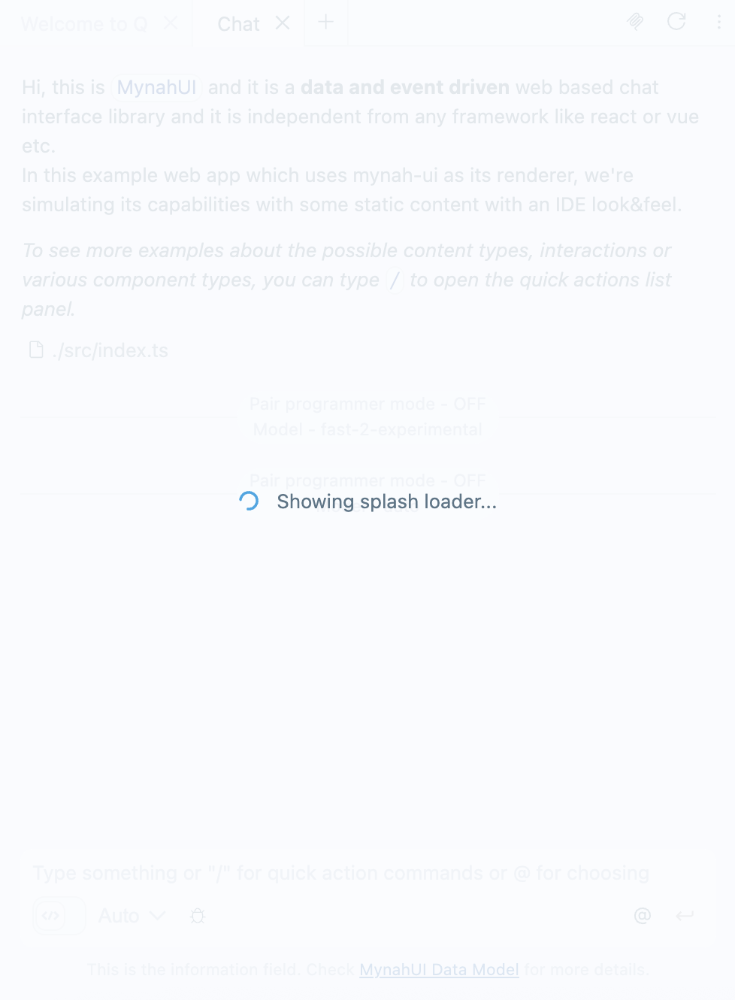

# How to use MynahUI
In this document you'll find what functions `mynah-ui` provides and how to use them. Additionally you'll see some examples about handling the tabs and tab data, adding chat items and streams.

#### Important notes before you start:
If you didn't already, please take a look to the **[Startup Guide](./STARTUP.md)** for how to generate an instance of `mynah-ui`. All below examples and usage guides will assume that you have a constant called **`mynahUI`** to reach those functions.

Another important information about handling the events can be found under **[Constructor Properties](./PROPERTIES.md)** document.

To see how to configure statics for MynahUI please refer to **[Configuration](./CONFIG.md)** document.

Lastly before you start reading here, you can find more details on the **[Data Model](./DATAMODEL.md)** document. That document also contains visuals related with each type of the chat message in detail.


#### All publicly available functions
```typescript
mynahUI.addChatItem(...);
mynahUI.addToUserPrompt(...);
mynahUI.updateLastChatAnswer(...);
mynahUI.updateChatAnswerWithMessageId(...);
mynahUI.endMessageStream(...);
mynahUI.serializeChat(...);
mynahUI.updateStore(...);
mynahUI.selectTab(...);
mynahUI.removeTab(...);
mynahUI.getSelectedTabId(...);
mynahUI.getAllTabs(...);
mynahUI.notify(...);
mynahUI.showCustomForm(...);
mynahUI.updateTabDefaults(...);
mynahUI.toggleSplashLoader(...);
mynahUI.destroy();
```

<p><br/></p>

---

<p><br/></p>

# Handling tabs
Even though you have the chance to partially handle the tabs, you should still want to keep track of the tabs in your app for various reasons like providing different controls/answers for different type of tabs. Since `MynahUI` doesn't have tab types, you should handle these kind of things on your own. (Also to keep the history and providing it back to the tab when you need.) **Since tab data flows can be asynchronous, you may want to keep track of which tab is doing what.** 

### Important Note:
You cannot close the tabs programmatically, but you can create new ones without user interaction. Closing a tab can only be done by a user interaction with the close button of the tab or middle clicking to the tab title. 

---

## Adding a new tab on runtime
Assume that you didn't set `tabs` property during the initialization of `mynahUI` and you want to add a new tab after the initialization completes. Or at some point, you want to create a new tab instead of using an existing one. Since everything on MynahUI runs through data store, you need to update the store by provind an empty string as the tabId. MynahUI will understand that there is no such tabId for an empty string and will create you a new one and return the newly created tab's id.  

```typescript
const mynahUI = new MynahUI({...});

const newTabId = mynahUI.updateStore('', {
  tabTitle: 'My new tab!'
});
```
But there is also one more important thing needs to be considered while generating a tab on the runtime without a user interaction, which is the `maxTabs` limit. (Details can be found under [Configuration](./CONFIG.md) document).

So if it reached to the max number of tabs can be opened, it will return undefined instead of returning the new tabId.

```typescript
const mynahUI = new MynahUI({...});

const newTabId: string | undefined = mynahUI.updateStore('', {
  tabTitle: 'My new tab!'
});
if(typeof newTabId !== string){
  console.warn(`Couldn't open a new tab, max tabs reached.`);
} else {
  // ...
}
```
**Please refer to the [Data Model](./DATAMODEL.md) documentation for details on which object on tab data store refers to what and how they are working**

---

## Selecting a tab programmatically (!)
You can switch to a tab with `tabId` and the `eventId`. 

### IMPORTANT NOTICE!
**`eventId` is a proof that the tab switch trigger is following an intended user action such as a new prompt of a button action**

```typescript
const mynahUI = new MynahUI({
  onChatPrompt: (tabId, prompt, eventId)=>{
    if(prompt?.command === 'fixed-tab'){
      // Assume that you have another tab already open and you know it's id.
      mynahUI.selectTab('fixed-tab-id', eventId);
    }
  }
});
```

---

## Removing a tab programmatically (!)
You can remove a tab with `tabId` and the `eventId`. 

### IMPORTANT NOTICE!
**`eventId` is a proof that the tab switch trigger is following an intended user action such as a new prompt of a button action**

```typescript
const mynahUI = new MynahUI({
  // Assume that you want to close the this tab through a action button inside the body of a card in the tab
  onInBodyButtonClicked: (tabId, messageId, action, eventId)=>{
    if(action?.id === 'close-tab'){
      mynahUI.removeTab('fixed-tab-id', eventId);
    }
  }
});
```

---

## Getting the selected tab id
To get the selected tab id, you can use the function described here. However if there is no (selected) tab, it will return `undefined`. Since if there are tab or even just a single tab, there should be at least one tab selected.

```typescript
const mynahUI = new MynahUI({...});

const selectedTabId = mynahUI.getSelectedTabId();
if(typeof selectedTabId !== string){
  console.warn(`No selected tab, which means that there is no tab.`);
} else {
  // ...
}
```
---

## Updating tab store (everything on that tab) on runtime
Assume that you didn't set `tabs` property during the initialization of `mynahUI` and you want to add a new tab after the initialization completes. Or at some point, you want to create a new tab instead of using an existing one. Since everything on MynahUI runs through data store, you need to update the store by provind an empty string as the tabId. MynahUI will understand that there is no such tabId for an empty string and will create you a new one and return the newly created tab's id.  

```typescript
const mynahUI = new MynahUI({...});

const selectedTabId = mynahUI.getSelectedTabId();
if(typeof selectedTabId !== string){
  console.warn(`No selected tab, which means that there is no tab.`);
} else {
  mynahUI.updateStore(selectedTabId, {
    tabTitle: 'Updated tab title',
    ...
  });
}
```
### Please refer to the [Data Model](./DATAMODEL.md) documentation for details for which object on tab data store refers to what and how they are working

<p><br/></p>

---

<p><br/></p>

# Handling chat items

There are two ways of adding chat items to the desired tab. However one of them is mainly being used to clean the chat items completely. So let's take a look to them both below. In additon to adding chat items, we'll also cover how you can stream a chat answer and handle the spinners during the stream.

---

## Adding Chat Items

### using `addChatItem` function
With addChatItem function, you're able to add a chat item onto the tab with given tabId. 

```typescript
const mynahUI = new MynahUI({
  tabs: {
    'tab-1': {
      isSelected: true,
      store: {}
    }
  }
});

mynahUI.addChatItem('tab-1', {
  type: ChatItemType.ANSWER,
  body: 'Body of the message',
  ...
});
```

### using `updateStore` function
With this method you can also append new chat items at once with the order they're given inside the chatItems array. But as defined, they will not replace the list, they will be appended. If you want to clear the whole chat items and add new ones, you need to send an empty list first. And send the new items through `addChatItem` one by one of updating the store with the new list.

```typescript
const mynahUI = new MynahUI({
  tabs: {
    'tab-1': {
      isSelected: true,
      store: {}
    }
  }
});

mynahUI.updateStore('tab-1', {
  chatItems: [
    {
      type: ChatItemType.ANSWER,
      body: 'Body of the message',
      ...
    },
    {
      type: ChatItemType.ANSWER,
      followUp: {
        text: 'Followups',
        options: [
          {
            pillText: 'Followup 1',
            prompt: 'followup 1',
            type: ''
          }
        ]
      }
      ...
    },
    ...
  ]
}); // these chat items will be appended.
```

**Note: if you want to clear all the chat items for that tab, send an empty array**

```typescript
mynahUI.updateStore('tab-1', {
  chatItems: []
});
```
**Please refer to the [Data Model](./DATAMODEL.md) documentation for types of chat items and how they appear differently on screen.**

---

## Creating and updating streaming chat items (`updateLastChatAnswer`)

You can update the streaming chat items on the runtime and you can only have one streaming chat item at once. First let's create a streaming chat item. We'll also set the tab in loading state to be sure that we have streaming animations before and during the stream.

```typescript
const mynahUI = new MynahUI({
  tabs: {
    'tab-1': {
      isSelected: true,
      store: {}
    }
  }
});

// set the tab to loading state. It will automatically animate the streaming card
// Also disable the prompt field to avoid the user enter a new prompt before the stream ends.
// You can also inform the user with the placeholder of the prompt input about why they are not able to write a new prompt
mynahUI.updateStore('tab-1', {
  loadingChat: true,
  promptInputDisabledState: true,
  promptInputPlaceholder: `Please hold, i'm generating your answer`
});

mynahUI.addChatItem('tab-1', {
  type: ChatItemType.ANSWER_STREAM,
  body: '',
  ...
});
```

Now on UI, we have a streaming chat item. Before we start to stream, **there is an important thing to know that you should send the whole body everytime you update the stream**. MynahUI doesn't make it appended for you, it will just show the given content each time.

```typescript
mynahUI.updateLastChatAnswer('tab-1', {
  body: 'Hello there',
});

...
// After a moment
mynahUI.updateLastChatAnswer('tab-1', {
  body: `Hello there, I'm MynahUI.`,
});

...
// After a moment
mynahUI.updateLastChatAnswer('tab-1', {
  body: `Hello there, I'm MynahUI. I am a data and event driven`,
});

...
// After a moment
mynahUI.updateLastChatAnswer('tab-1', {
  body: `Hello there, I'm MynahUI. I am a data and event driven chat interface for web.`,
});

...
// After a moment
mynahUI.updateLastChatAnswer('tab-1', {
  followup: {
    text: 'What you can do more?',
    options: [
      {
        pillText: 'Show me examples',
        type: 'Show MynahUI examples',
      },
      {
        pillText: 'Which projects use MynahUI as their interface?',
        prompt: 'Which projects MynahUI is being used',
      }
    ],
  }
});

// Since the stream is ended, stop the spinner and enable the prompt input again.
mynahUI.updateStore('tab-1', {
  loadingChat: false,
  promptInputDisabledState: false,
  promptInputPlaceholder: 'Type your question here.'
});
```

Except setting the loading state back to false and enabling the prompt input back you don't need to do anything more to end a streaming. When you add a new chat item MynahUI will automatically release the last streaming chat answer and convert it to a normal answer. Which means that it will not be updated anymore. 

As you can update the body of a streaming card, you can also update the other information related with the card. Like adding the related sources etc. 
**Please refer to the [Data Model](./DATAMODEL.md) documentation for types of chat items and how they appear differently on screen.**

---

## updating chat items with messageId (`updateChatAnswerWithMessageId`)

You can update any kind of chat item on the runtime by specifying its `messageId`. First let's create a chat item.

```typescript
const mynahUI = new MynahUI({
  tabs: {
    'tab-1': {
      isSelected: true,
      store: {}
    }
  }
});

mynahUI.addChatItem('tab-1', {
  type: ChatItemType.ANSWER,
  body: '',
  messageId: 'my-chat-item'
  ...
});
```

Now on UI, we have a new chat item with a `messageId -> "my-chat-item"` . Before we update the card, please beware that those `messageId`s have to be unique.

And as an additional notice, you don't need to send the whole `ChatItem` object each time you need to udpate. Only sending the desired attributes is enough. But it is **not** checking the object deeply. Just using the main level attributes from the previous data of the card if you leave them unset.

```typescript
mynahUI.updateChatAnswerWithMessageId(
  'tab-1', 
  'my-chat-item', //Message ID
  {
    body: 'Hello there', // We just need to update the body here
  }
);
```

After the `updateChatAnswerWithMessageId` call, you'll see that the body of the card will be updated with its new value.

As you can update the body of a card, you can also update the other information related with the card. Like adding the related sources etc. 
**Please refer to the [Data Model](./DATAMODEL.md) documentation for types of chat items and how they appear differently on screen.**

---

## Ending a chat stream (`endMessageStream`)

You can stop a streaming message. But basically it will not make any change other than the type of the card to `ChatItemType.ANSWER`. And while ending the stream, you can also update the card with a partial ChatItem.

**BUT** this function also returns you some details related with the rendered card. Currently only the `totalNumberOfCodeBlocks` inside that card which gives the number of code blocks with copy and insert buttons.

```typescript
const mynahUI = new MynahUI({
  tabs: {
    'tab-1': {
      isSelected: true,
      store: {}
    }
  }
});

const chatItemRenderDetails = mynahUI.endMessageStream('tab-1', 'message-id', {
  buttons: [{
    ...
  }]
  ...
});

console.log(chatItemRenderDetails); >> totalCodeBlocks: N
```

Can you end stream for a card you already ended the stream? Basically yes because it is just changing the type and returns you some insights about that card.

---

## Serializing a chat (`serializeChat`)

You can serialize an entire chat from a specific tab using this function. Only the card bodies will be included, meaning that buttons and other interactable components are left out. There are two output options for the serialization:
- **Markdown:** get all the bodies from chat items in markdown format so that it serves as the contents of a valid `.md` file. Each card body is separated by `\n\n---\n\n`.
- **HTML:** get a string which serves as the contents of a valid `.html` file. It consists of a centered chat container, containing all the chat item bodies in cards. All the relevant stylesheets from MynahUI are included in the `<style>` section of the string.

The following example shows how serialization could be used to download an export of a tab's chat:
```typescript
const serializedChat = mynahUI.serializeChat(tabId, 'markdown')
const blob = new Blob([serializedChat], { type: 'text/plain' });
const url = URL.createObjectURL(blob);
const link = document.createElement('a');
link.download = 'exported-chat.md';
link.href = url;
link.click();
```

---

## Adding code attachments to prompt field (`addToUserPrompt`)

You can add code attachments under the prompt field of the desired tab. When user fills the prompt field and sends it, the attached code block will be appended at the end of the prompt text. It accepts max chars set through **[CONFIG](./CONFIG.md#maxUserInput)** however you don't need to worry about it. MynahUI will automatically crop it depending on the available chars left from the prompt field itself by using a `96` chars of threshold. **So beware that for example if you want 4000 chars exact, you need to give 4096 to the config.**

Another note is the option to render a markdown content or put the incoming content to a code block as is without parsing it. **The default is `'markdown'`**. However you can set the `type` to `'code'` to render the content directly in a code block without parsing it like a markdown.

```typescript
mynahUI.addToUserPrompt('tab-1', `
\`\`\`typescript
const a = 5;
\`\`\`
`, 'markdown');
```

Above code will look identical with the below one (`type` argument showcase)


```typescript
mynahUI.addToUserPrompt('tab-1', 'const a = 5;', 'code');
```

<p align="center">
  
</p>

And when user sends the prompt attached code will be appended to the bottom.

<p align="center">
  
</p>

<p><br/></p>

---

## Getting all tabs with their store data (`getAllTabs`)

You can get all tabs and their latest updated store data. Do not use this function to handle the data. This function aims to help you with your test scenarios which you can grab the data and do your comparisons.

```typescript
mynahUI.getAllTabs();
// returns an object map of tabIds and their store data.
```
---

<p><br/></p>

# Notifications (`notify`)

You can give notifications through mynahUI which will appear inside the mynah ui root container block.

```typescript
mynahUI.notify({
  content: 'Hello there! Here is a test notification',
  duration: 5,
  title: 'This is a notification',
  type: NotificationType.INFO,
  onNotificationClick: () => {
    // when notification itself is clicked
    // do not forget that when notification is clicked, it closes automatically
  },
  onNotificationHide: () => {
    // when notification is closed
  },
});
```
<p align="center">
  
</p>

To see the different notification types and how they look **please refer to the [Data Model](./DATAMODEL.md) documentation for details of the `NotificationProps`**

---

<p><br/></p>

# Custom popup forms (`showCustomForm`)

You can create custom forms which will pop up from the bottom of the screen. Let's see our example below.

```typescript
mynahUI.showCustomForm(
  'tab-1', 
  [
    {
      type: 'textarea',
      id: 'comment',
      mandatory: true,
      title: 'What should be improved about this file?'
    }
  ], // This is the set of the form items
  [
    {
      id: 'save-comment',
      text: 'Comment',
      status: 'info', // Doesn't matter which status you'll give here, if you set status it will show this button as a primary one
      waitMandatoryFormItems: true
    },
    {
      id: 'cancel-comment',
      text: 'Cancel',
      waitMandatoryFormItems: false
    }
  ], // This is the set of buttons
  'Comment on file', // Title of the form popup
  'Q will use comments as feedback when regenerating code.' // Additional content body block which accepts MARKDOWN
);
```
<p align="center">
  
</p>

To see the form item objects structure and the buttons structure, please go take a look to [DATAMODEL / formItems](./DATAMODEL.md#formItems) and [DATAMODEL / buttons](./DATAMODEL.md#buttons) ** because the structure of the items are identical. **


<p><br/></p>

# Update tab defaults (`updateTabDefaults`)

You can use this method by providing the same value for the construcor property (`defaults`) to update the tab default values. **Do not foget that it will not effect anything in an already created tab**.

```typescript
mynahUI.updateTabDefaults({store: {
  chatItems: [
    {
      ...,
      body: 'Hello!',
      ...
    }
  ]
}});
```
<p align="center">
</br>
</p>


# Show splash screen spinner (`toggleSplashLoader`)

You can enable or disable window wide splash screen spinner with or without text.

```typescript
mynahUI.toggleSplashLoader(true, 'Initializing');
```
<p align="center">
  
</p>

# Destroy Mynah UI State (`destroy`)

You can use this method to tear down the existing Mynah UI state. This is useful if you want to run several tests on fresh instances of Mynah UI.

```typescript
mynahUI.destroy();
```